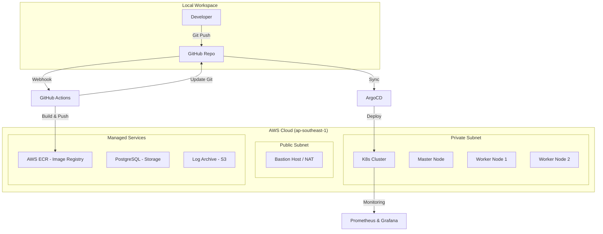

# 🚀 LogAnalyzer Deployment & SRE Handbook
> **Project:** Advanced Log Analysis Security Platform  
> **Target:** ShopBack SRE Technical Assessment  
> **Author:** Thức Do Huu  

---

## 🏗️ 1. Kiến trúc Hệ thống (Architecture)
Hệ thống được thiết kế theo mô hình **GitOps & Cloud-Native**, đảm bảo tính sẵn sàng cao (High Availability) và khả năng mở rộng tự động (Scalability).



---

## 🛠️ 2. Chuẩn bị (Prerequisites)
Trước khi bắt đầu, hãy đảm bảo máy local đã cài đặt:
- **Terraform:** v1.5+
- **AWS CLI:** Cấu hình với quyền Administrator.
- **kubectl:** Để điều khiển Cluster.
- **SSH Client:** Để kết nối vào Bastion/Master.

---

## 🚀 3. Quy trình Triển khai (Deployment Steps)

### Bước 1: Khởi tạo Hạ tầng (Infrastructure as Code)
Sử dụng Terraform để tạo VPC, EC2, ECR và Security Groups.
```bash
cd terraform
terraform init
terraform apply -auto-approve
```

### Bước 2: Cấu hình Kubernetes Cluster
Kết nối vào máy Master và khởi tạo Cluster (Kubeadm).
```bash
# SSH vào Master qua Bastion
ssh -J ubuntu@<BASTION_IP> ubuntu@<MASTER_PRIVATE_IP>

# Chạy script khởi tạo (đã chuẩn bị sẵn)
sudo /var/log/k8s-init.sh
```

### Bước 3: Thiết lập GitOps với ArgoCD
Triển khai ArgoCD để quản lý vòng đời ứng dụng.
```bash
kubectl create ns argocd
kubectl apply -n argocd -f https://raw.githubusercontent.com/argoproj/argo-cd/stable/manifests/install.yaml
```

### Bước 4: Triển khai Stack Giám sát (Monitoring)
Cài đặt Prometheus và Grafana để theo dõi sức khỏe hệ thống.
```bash
# Cài đặt qua Helm Chart
helm install prometheus prometheus-community/kube-prometheus-stack -n monitoring --create-namespace
```

---

## 📊 4. Giám sát & Quản lý (Observability)

### Truy cập Dashboard
| Dịch vụ | Địa chỉ Local | Lệnh Port-Forward |
| :--- | :--- | :--- |
| **ArgoCD** | `https://localhost:8080` | `ssh -L 8080:localhost:8080 loganalyzer-master "kubectl port-forward svc/argocd-server -n argocd 8080:443"` |
| **Grafana** | `http://localhost:3000` | `ssh -L 3000:localhost:3000 loganalyzer-master "kubectl port-forward svc/prometheus-grafana -n monitoring 3000:80"` |

### Tính năng SRE tiêu biểu:
- **Auto-scaling (HPA):** Hệ thống tự động tăng số lượng Pod khi CPU vượt 70%.
- **Self-healing:** Kubernetes tự động khởi động lại Pod nếu Backend bị crash.
- **Security Context:** Frontend chạy với quyền hạn hạn chế để đảm bảo an toàn.

---

## 🛠️ 5. Xử lý sự cố (Troubleshooting)

| Vấn đề | Cách xử lý |
| :--- | :--- |
| **ErrImagePull** | Kiểm tra quyền ECR và `imagePullSecrets` trong K8s. |
| **CrashLoopBackOff** | Xem log bằng lệnh: `kubectl logs <pod_name> -n loganalyzer`. |
| **Connection Timeout** | Cập nhật IP của bạn vào `terraform.tfvars` và chạy `terraform apply`. |

---

## 🔍 7. Kiểm tra & Vận hành (Verification)

Sau khi triển khai, hãy sử dụng các lệnh sau để đảm bảo hệ thống chạy đúng luồng GitOps:

### Kiểm tra trạng thái triển khai
```bash
# Xem các ứng dụng trong ArgoCD
kubectl get applications -n argocd

# Theo dõi quá trình cập nhật Pod (Rolling Update)
kubectl get pods -n loganalyzer -w
```

### Kiểm tra kết nối Registry (ECR)
```bash
# Xác nhận ServiceAccount có quyền kéo image
kubectl describe sa loganalyzer-sa -n loganalyzer
```

### Xem Log ứng dụng (SRE Debugging)
```bash
# Xem log trực tiếp từ Backend
kubectl logs -l app=loganalyzer-production-backend -n loganalyzer -f --tail=100
```

---

## 🧹 8. Dọn dẹp (Cleanup)
Để tránh phát sinh chi phí AWS khi không sử dụng:
```bash
cd terraform
terraform destroy -auto-approve
```

---
> **SRE Mindset:** *"Nếu bạn phải làm một việc quá 2 lần, hãy tự động hóa nó."* - Toàn bộ dự án này là minh chứng cho tư duy đó.
